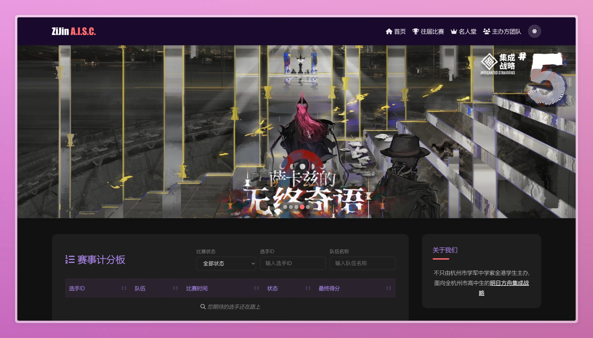

# ZiJin A.I.S.C. - 明日方舟集成战略赛事平台
## 发布说明文档



## 版本信息
- **当前版本**: v1.14.86
- **发布日期**: 2025年11月15日
- **开发团队**: 杭州市学军中学紫金港学生团队

## 📋 项目概述
ZiJin A.I.S.C. 是一个面向杭州市高中生的《明日方舟》集成战略模式赛事平台，由杭州市学军中学紫金港学生主办。平台旨在为热爱明日方舟集成战略玩法的学生提供一个公平、专业的比赛环境，促进玩家间的交流与学习。

## ✨ 核心功能特性

### 赛事管理系统
- **赛事信息展示**: 提供最新赛事详情、赛程安排、规则说明等完整信息
- **在线计分板**: 实时更新选手成绩，支持按状态、选手ID、队伍名称筛选和排序
- **多届赛事支持**: 完整记录和展示历届赛事的精彩瞬间和结果
- **名人堂系统**: 表彰在赛事中表现优异的选手，展示其荣誉成就
- **赛事通讯**: 定期发布赛事相关的新闻、攻略和活动信息

### 用户体验优化
- **响应式设计**: 完美适配从手机到桌面的各种设备屏幕尺寸
- **智能主题切换**: 支持明暗两种主题模式，可根据系统偏好自动切换
- **流畅动画效果**: 页面元素滚动展示精美动画，提升视觉体验
- **便捷导航结构**: 提供清晰的导航结构和一键返回顶部功能
- **键盘快捷键支持**: Esc键快速返回顶部，提升操作便捷性

### 技术特色
- **原生JavaScript实现**: 不依赖任何前端框架，保证轻量级和高性能
- **模块化组件设计**: 代码结构清晰，易于维护和扩展
- **图片懒加载**: 优化页面加载速度，提升用户体验
- **本地存储支持**: 记住用户主题偏好等设置
- **动态数据展示**: 通过JSON文件动态加载和展示赛事数据

## 🛠 技术栈

- **前端技术**: HTML5、CSS3、JavaScript (ES6+)
- **样式库**: Font Awesome 图标库
- **数据存储**: JSON 文件格式
- **页面结构**: 模块化组件设计
- **交互功能**: 原生JavaScript实现，无框架依赖
- **响应式布局**: CSS Flexbox和Grid布局

## 🚀 安装部署指南

### 本地部署
1. 确保您的系统已安装现代浏览器（推荐Chrome、Firefox、Edge）
2. 克隆或下载项目源码到本地
   ```bash
   git clone https://github.com/zbrocks/ZiJin-AISC.git
   ```
3. 在文件管理器中找到项目文件夹，双击 `index.html` 即可在浏览器中打开
   
   或者使用Python简单HTTP服务器：
   ```bash
   cd ZiJin-AISC
   python3 -m http.server 8080
   ```
   然后在浏览器中访问 `http://localhost:8080`

### 服务器部署
1. 准备一台支持静态文件服务的Web服务器（如Nginx、Apache等）
2. 将项目所有文件上传到Web服务器的根目录或指定子目录
3. 配置Web服务器以正确处理HTML、CSS、JavaScript和JSON文件
4. 通过服务器IP或域名访问平台

## 📖 使用指南

### 浏览赛事信息
1. 访问首页 `index.html`
2. 查看顶部轮播图了解最新赛事动态
3. 在计分板区域查看选手成绩，可使用筛选器和排序功能
4. 浏览下方的文章卡片了解详细赛事信息和规则

### 导航其他页面
- **往届比赛**: 点击顶部导航栏的"往届比赛"查看历史赛事
- **名人堂**: 点击顶部导航栏的"名人堂"查看优秀选手信息
- **主办方团队**: 点击顶部导航栏的"主办方团队"了解团队成员
- **FAQ**: 在页脚或侧边栏找到FAQ链接，解答常见问题

### 主题切换
- 点击顶部导航栏中的太阳/月亮图标切换明暗主题
- 主题设置会保存在本地，下次访问时自动应用

### 移动端适配
- 在小屏幕设备上，导航栏会自动转换为汉堡菜单
- 点击屏幕右上角的汉堡菜单按钮展开导航选项

## 📝 配置说明

### 数据配置
- **选手数据**: 存储在 `assets/json/players.json` 文件中，包含选手ID、姓名、队伍等信息
- **状态配置**: 存储在 `assets/json/status-config.json` 文件中，定义比赛状态的映射关系
- **团队成员数据**: 存储在 `assets/json/team-members.json` 文件中
- **赛事数据**: 存储在 `assets/json/events/` 目录下

### 样式配置
- 全局样式文件位于 `assets/css/common.css`
- 各页面特定样式文件位于 `assets/css/` 目录下，如 `index.css`、`article.css` 等
- 主题变量定义在 `common.css` 中，可通过CSS变量进行全局主题控制

### 功能配置
- 各页面功能实现的JavaScript文件位于 `assets/js/` 目录下
- `common.js` 包含通用功能（主题切换、滚动效果等）
- 特定页面功能由对应名称的JavaScript文件实现（如 `index.js`、`rule.js` 等）

## 🎯 功能模块详解

### 首页模块 (`index.html`)
- **轮播图功能**: 自动播放赛事宣传图片，支持手动切换
- **计分板系统**: 支持多条件筛选和多字段排序
- **文章卡片**: 展示最新赛事资讯和规则说明
- **侧边栏**: 提供快速导航和社交媒体链接

### 赛事规则模块 (`pages/rules/`)
- 详细展示各届赛事的规则说明
- 支持响应式布局，在各种设备上都有良好的阅读体验

### 名人堂模块 (`pages/hall-of-fame.html`)
- 展示历届赛事获奖选手信息
- 提供搜索和筛选功能

### 团队介绍模块 (`pages/team.html`)
- 展示赛事主办方团队成员信息
- 包含成员角色和职责说明

## 🔧 开发说明

### 项目结构
```
├── index.html           # 首页
├── 404.html             # 404页面
├── assets/              # 资源文件夹
│   ├── css/             # CSS样式文件
│   ├── js/              # JavaScript脚本
│   ├── images/          # 图片资源
│   └── json/            # 数据文件
└── pages/               # 子页面
    ├── articles/        # 文章页面
    ├── events/          # 赛事页面
    ├── rules/           # 规则页面
    ├── FAQ.html         # 常见问题
    ├── hall-of-fame.html # 名人堂
    └── team.html        # 团队介绍
```

### 添加新内容
1. **添加新赛事**: 在 `pages/rules/` 和 `pages/events/` 目录下创建对应的HTML文件
2. **更新数据**: 修改或创建 `assets/json/` 目录下的对应JSON文件
3. **更新首页链接**: 在 `index.html` 中添加新的文章卡片或链接

### 自定义样式
- 修改 `assets/css/common.css` 中的CSS变量可以快速更改全局主题
- 为新页面创建特定的CSS文件，并在HTML文件中引入

## 🤝 贡献指南

我们欢迎对本项目提出建议和改进，如有兴趣参与贡献，请按以下步骤操作：

1. Fork 本项目仓库
2. 创建您的特性分支（`git checkout -b feature/AmazingFeature`）
3. 提交您的更改（`git commit -m 'Add some AmazingFeature'`）
4. 推送到分支（`git push origin feature/AmazingFeature`）
5. 开启 Pull Request

### 开发规范
- 代码风格保持一致
- 为新功能添加必要的注释
- 确保更改不会破坏现有功能
- 测试在不同浏览器中的兼容性

## 📞 联系方式

如有任何问题或建议，请通过以下方式联系我们：
- **邮箱**: [zj_aisc@qq.com](mailto:zj_aisc@qq.com)
- **微信**: xXD66c
- **QQ**: 1075243585
- **B站**: [https://space.bilibili.com/1488722556](https://space.bilibili.com/1488722556)

## 📜 许可证

本项目采用 [MIT License](https://opensource.org/licenses/MIT) 开源许可证。

## 🏆 特别鸣谢

感谢所有为ZiJin A.I.S.C.赛事平台做出贡献的开发者和志愿者，以及所有参与和支持我们赛事的选手和观众！

---
更新记录:

**v1.14.86 - 2025年10月5日**
- 首次正式发布
- 实现所有核心功能模块
- 完善主题切换功能